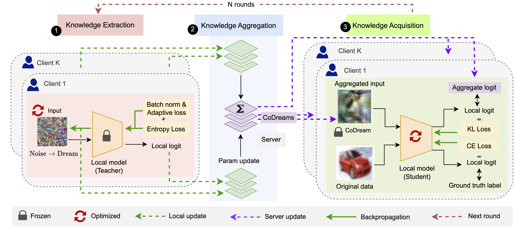
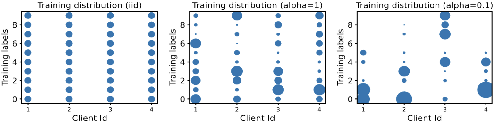

<div align="center">
  <h1>Collab Learning</h1>

  <p style="font-size:1.2em">
    <a href="https://github.com/tremblerz"><strong>Abhishek Singh<sup>*</sup></strong></a> ·
    <a href="https://github.com/GauriGupta19"><strong>Gauri Gupta<sup>*</sup></strong></a> ·
    <a href="https://github.com/RitvikKapila"><strong>Ritvik Kapila</strong></a> ·
    <a href="https://github.com/photonshi"><strong>Yichuan Shi</strong></a> ·
    <a href="https://github.com/Tropylium"><strong>Alex Dang</strong></a> ·
    <a href="https://mitmedialab.github.io/codream.github.io/"><strong>Sheshank Shankar</strong></a> ·
    <a href="https://github.com/mohammedehab2002"><strong>Mohammed Ehab</strong></a> ·
    <a href="https://www.media.mit.edu/people/raskar/overview/"><strong>Ramesh Raskar</strong></a> 
  </p>

  <p align="center" style="margin: 2em auto;">
    <a href='https://mitmedialab.github.io/codream.github.io/' style='padding-left: 0.5rem;'></a>
    <a href='https://arxiv.org/abs/2402.15968'></a>
  </p>

  <p align="center" style="font-size:16px">Official implementation of the CoDream paper, a collaborative learning method by sharing distilled images that proposes a novel way to perform learning in a collaborative, distributed way via gradient descent in the data space. </p>
  <!-- Images? -->
  <!-- <p align="center">
    
  </p> -->
</div>


Overview of the CoDream pipeline comprising three stages: (1) Knowledge Extraction— each client generates dreams, representing the extracted knowledge from their local models (teacher). Starting with random noise images and frozen teacher models,
clients optimize to reduce entropy on the output distribution while regularizing the batch norm and adaptive loss. The clients share their local updates of dreams and logits with the server. (2) Knowledge Aggregation—server aggregates dreams and soft labels from clients to
construct a CoDream dataset. (3) Knowledge Acquisition—clients update their local models through two-stage training (i) on jointly optimized co-dreams with knowledge distillation (where clients act as students) and (ii) local dataset with cross-entropy loss. 

<!-- Introduction: fl in iid/ noniid; noniid supports heterogeneity parameter, list of models -->
<!-- Link to paper -->

## Table of Contents
1. [Introduction](#introduction)
2. [Getting Started](#baselines)
    - [Installation](#installation)
    - [Config](#defining-config)
    - [Running with MPI](#running-with-mpi)
    - [Logging](#logging)
    - [Tensorboard Monitoring](#monitoring-with-tensorboard)

    </ul>
<!-- 4. [Training](#training) -->
3. [Code Structure](#developer)
4. [Citation](#citation)
5. [License](#license)

## Introduction <a id="introduction"></a>
Collaborative learning by sharing distilled images, a library for the Co-Dream paper that proposes a novel way to perform learning in a collaborative, distributed way via gradient descent in the data space. This library provides a pipeline for benchmarking centralized federated learning under both iid and non-iid data settings. We provide implementation for the following model architecture, datasets, and federated learning algorithm:

| Model Architecutre           | Datasets       | FL Algorithm            |
|------------------------------|----------------|-------------------------|
| LeNet5                       | CIFAR[10, 100] | CoDream, CoDream-fast |
| MobileNet                    | PathMNIST      | Centralized             |
| VGG[8, 11, 13, 16, 19]       | MNIST          | Isolated                |
| ResNet[18, 34, 50, 101, 152] | EMNIST         | FedAvg                  |
|                              | SVHM           | FedGen                  |
|                              |                | FedProx                 |
|                              |                | Moon                    |
|                              |                | Scaffold                |
|                              |                | AvgKD                   |

* `CoDream`:  We introduce a novel collaborative learning approach where clients jointly optimize synthetic dreams(starting from random noise on frozen local models) using federated averaging for performing collective knowledge sharing across clients.  
* `CoDream-fast`:  To accelerate the process of generating dreams, we implement the [Fast-datafree](https://arxiv.org/pdf/2112.06253.pdf) approach on top of our algorithm. CoDream-fast learns common features using a metagenerator for initializing dreams, instead of initializing with random noise every time.  
We also include Independent and Centralized training baselines for reference.  
* `Isolated`: Each client trains a model only on its local dataset  
* `Centralized`: All the client data is aggregated in a single place and a single model is trained on the combined data  

<!-- TODO: add possible mpirun note? -->

## Getting Started <a id="baselines"></a>
<!-- how to run baselines - include brief overview of supported baselines, how to define config, and how dataset is downloaded -->

The abbreviated list below shows steps to getting your first run started using the collab_learning library:

### 1. Installation <a id="installation"></a>
To install all dependencies for using the package, please run
```
pip install -r requirements.txt
```
Datasets and models in the above list are automatically installed upon the first run. For importing custom models, datasets, and FL algorithms, please see the implementation details in `models/`, `utils/data_utils.py`, and `algos/`

### 2. Defining Config <a id="defining-config"></a>
We design our experiments for both IID and non-IID settings. For non-iid cases, we provide support for different kinds of settings which can be found in `utils/data_utils.py` as follows:  
1. ```non_iid_balanced_labels```: data from all labels are non-iid distributed among clients according to Dirichlet distribution Dir(α), where clients can have an unequal number of samples  
2. ```non_iid_balanced_clients```: each client has an equal number of samples that are non-iid distributed among labels according to Dirichlet distribution Dir(α)  
3. ```non_iid_labels```: an extreme non-iid case where each client has only certain labels

First, define the desired experimental configuration in the `configs` folder. For IID_experimental setups, add the config in `iid_clients.py`. For non-iid, add in `non_iid_clients.py` and specify ```exp_type``` starting with the desired non-iid setting such as ```non_iid_balanced_clients_fl```.  A sample config is shown below for iid scaffold:


Visualization of statistical heterogeneity among CIFAR10 clients: Client IDs on the x-axis, class labels on the y-axis, and point size reflects the number of training samples per label for each use.  

```
fl = {
    "algo": "fedavg",
    "exp_id": 10,
    "exp_type": "iid_clients_fl",
    "dset": "cifar10",
    "dump_dir": "./expt_dump/cifar10/iid/",
    "dpath": "./imgs/cifar10",
    "seed": 4,
    # server can have overlapping device ids with clients because
    # both are not used at the same time
    # Learning setup
    "num_clients": 4, "samples_per_client": 1000,
    "device_ids": {"node_0": [3], "node_1": [6], "node_2": [2], "node_3": [4], "node_4": [5]},
    "epochs": 400, "local_runs": 5,
    "model": "resnet18", "model_lr": 0.1, "batch_size": 256,
    "exp_keys": ["algo", "seed"]
}
```
A detailed list of config parameters can be found [here](https://github.com/tremblerz/collab_learning/blob/codream_public/configs/README.md)

### 3. Running with MPI <a id="running-with-mpi"></a>

After the experimental config is set, run experiments by calling main.py:
```
mpirun -np N -host localhost:N python main.py -b "{path_to_config_file}"
```
where N is a number that represents how many nodes there are in the system. With the example config above, `N=3` because there are 2 clients and 1 server.  It takes as argument a config file path by replacing {path_to_config_file} with the actual path of the desired config file, where the default config file is ```iid_clients.py```.  

Upon launch, ```main.py``` parses the config file, and based on its configuration runs Scheduler.py, which takes care of the rest of our program.

### 4. Logging <a id="logging"></a>

To capture logs and ensure that experiments are reproducible, the collab-learning library copies all files and folder structure -- as well as the actual statistics of model performance -- into a separate `log` folder that will be created upon the first run. 

### 5. Monitoring with Tensorboard <a id="monitoring-with-tensorboard"></a>

The code provides support for tensorboard monitoring. To open tensorboard, run the following command inside the log folder:

```tensorboard --logdir ./ --host 0.0.0.0```

Once tensorboard outputs the link, click into it to view the logged performances.

<!-- how to run training - essentially very similar to baseline but maybe more detail on config / code structure? -->

## Control Flow <a id="developer"></a>

Server:
The server sends a signal to start the warmup rounds. Once it receives the signal from the client class that the warmup rounds are over, it runs a single round and updates the data statistics to the terminal for as many epochs as the config file specifies.
A single round involves signaling to the students to start their representations, receiving them, and sending each representation to each student except for the student who generated it. We store each client’s representations as images and update the statistics once all the students are done.<br />

Client:
Upon receiving the signal to begin from the server, the algorithm starts the training process with warmup rounds, signaling to the server when these rounds are completed. It generates representations of the data and sends them to the server. Once the server sends those representations back, it chooses the best n among them(where n is a number specified by config). Afterward, for each epoch specified by the config, it trains the model on the test data, local data, and representations from the server, and sends it to the server.<br />

The program terminates when both the server and the client have run their rounds for the correct number of epochs.<br />

To further examine these training methods, take a look at the research paper on which this project is based in [here](https://arxiv.org/abs/1912.08795).  
 

## Citation <a id="citation"></a>
```
@misc{singh2024codream,
  title={CoDream: Exchanging dreams instead of models for federated aggregation with heterogeneous models}, 
  author={Abhishek Singh and Gauri Gupta and Ritvik Kapila and Yichuan Shi and Alex Dang and Sheshank Shankar and Mohammed Ehab and Ramesh Raskar},
  year={2024},
  eprint={2402.15968},
  archivePrefix={arXiv},
  primaryClass={cs.LG}
}
```
## License <a id="license"></a>
The CoDream code is available under the [Apache License](LICENSE).
